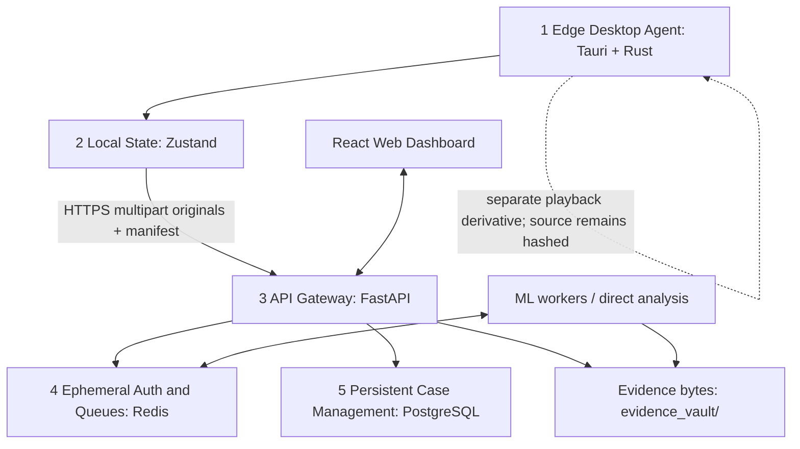

# SentinelFS

SentinelFS is a planned and actively developed digital-forensics platform for DVR/NVR evidence acquisition, recovery, integrity verification, video analysis, and case reporting. Its intended end-to-end workflow connects a Tauri/Rust edge agent, local case state, a FastAPI gateway, Redis coordination, PostgreSQL case management, a web dashboard, computer-vision pipelines, and report-generation tooling.

This master document records both the full project vision and the current prototype. Capability labels distinguish **Implemented**, **Prototype/Experimental**, and **Planned/Needs Validation** features. A roadmap goal is not a compatibility or legal-compliance guarantee.

## Clickable Table of Contents

- [Deliverable 1: Comparative Analysis of Major DVR/NVR OEMs](#deliverable-1-comparative-analysis-of-major-dvrnvr-oems)
- [Deliverable 2: System Architecture Documentation](#deliverable-2-system-architecture-documentation)
- [Deliverable 3: Standard Operating Procedures](#deliverable-3-standard-operating-procedures)
- [Deliverable 4: Validation Reports and Evidence Integrity](#deliverable-4-validation-reports-and-evidence-integrity)
- [Deliverable 5: User Manuals](#deliverable-5-user-manuals)
- [Deliverable 6: Final Project Report and Assets](#deliverable-6-final-project-report-and-assets)
- [Installation and Local Development](#installation-and-local-development)
- [API Reference](#api-reference)
- [Verification and Test Procedure](#verification-and-test-procedure)
- [Limitations, Safety, and Legal Notice](#limitations-safety-and-legal-notice)
- [Glossary and Further Documentation](#glossary-and-further-documentation)

## Reading This Document

| Label | Meaning |
|---|---|
| **Implemented** | Code exists in this repository and can be built or exercised in the stated configuration. It may still require operational validation before casework. |
| **Prototype/Experimental** | A working path or component exists, but behavior, portability, completeness, or accuracy is not yet independently qualified. |
| **Planned/Needs Validation** | Part of the target architecture or project plan; do not rely on it in an investigation until implementation, test evidence, and release documentation are supplied. |

The platform is not a substitute for agency policy, a hardware write blocker, verified acquisition tooling, examiner judgment, or legal review.

## Deliverable 1: Comparative Analysis of Major DVR/NVR OEMs

### Scope and terminology

DVR/NVR storage differs by product family, board/platform, firmware, region, codec configuration, and export method. A single OEM may ship several unrelated recording formats. The filesystem, recording index, exported clip container, video codec, and audio codec are separate layers; identifying one does not establish the others.

SentinelFS currently performs byte-signature scanning. It does not generally mount recorder filesystems, parse every vendor database/index, decrypt protected content, or reconstruct all OEM metadata. The matrix therefore distinguishes observed engineering concerns from implemented support. Confirm every statement against the exact model/firmware and a lawfully acquired known-good sample before declaring compatibility.

| OEM | Proprietary filesystem / recording organization | Encoding and export considerations | Recovery challenges | SentinelFS relationship and status |
|---|---|---|---|---|
| **Dahua Technology** | Recorder models can use embedded Linux partitions and Dahua-managed indexes/segments. There is no one filesystem layout that safely describes all generations. | DAV-family exports and DHAV-framed records are encountered; elementary video/audio codecs vary by model/configuration and may need private metadata or initialization information. | Frame length/channel/timestamp parsing, index frames, fragmented or overwritten data, and reconstructing continuous audio/video. | **Implemented signature parser:** scans `DHAV`, validates expected frame-length/header bounds, groups records by channel, skips the current parser's `0xF1` index marker, and hashes output. **Not implemented:** general Dahua HDD filesystem or index database recovery. |
| **CP Plus** | Multiple product families and OEM/ODM platforms exist; disk layout must be determined per model and firmware. A brand-level filesystem assertion is not reliable. | Export types can differ by product generation; H.264/H.265 and standard containers may be available, but a specific extension is not universal. | Rebrand variation, proprietary indexes, export wrappers, embedded timestamps, and channel/time associations can differ between families. | **Planned/Needs Validation:** no CP Plus-specific parser is implemented. Supported generic signatures may recover compatible byte streams, but that is not the same as CP Plus device support. |
| **Honeywell Security** | MAXPRO and other product lines have different recorder software, databases, and storage conventions. | Standard codecs may appear in exports; wrapper/index formats depend on model and export procedure. | Proprietary archive packaging, indexes, authentication/encryption, and preserving event metadata may require vendor software or model documentation. | **Planned/Needs Validation:** no Honeywell-native disk or index parser is implemented. Hashing and supported generic stream processing may be used after authorized export. |
| **TP-Link** | VIGI and other recorder/camera configurations vary. Cloud-connected systems and local NVR storage need separate treatment. | Exported clips may use common containers/codecs; internal recorder files and app/cloud packages are not assumed to match those exports. | Cloud/app mediation, segment packaging, recorder indexes, time metadata, and firmware variation can limit raw carving. | **Planned/Needs Validation:** no TP-Link-specific parser is implemented. Use exact-model samples to qualify any generic recovery path. |
| **Godrej Security Solutions** | Product generations may use different OEM platforms and storage indexes; no universal on-disk layout is asserted here. | Export formats and codecs must be confirmed for the exact recorder and firmware. | ODM/rebrand changes, proprietary timestamps/indexes, segmentation, and playback dependencies complicate raw reconstruction. | **Planned/Needs Validation:** no Godrej-specific parser is implemented. Supported standard exports can be hashed/ingested; raw image recovery needs validated fixtures. |
| **Uniview (UNV)** | Embedded filesystems may be accompanied by proprietary recording indexes and recorder-specific metadata. | Standard video codecs and vendor backup/export packages may coexist; export options vary by product line. | Recovering a stream without its index may lose camera/time mapping; fragmented data or missing codec headers may prevent decoding. | **Planned/Needs Validation:** no Uniview-native filesystem, package, or index parser is implemented. Generic byte signatures are best-effort only. |
| **Hikvision** | Recorder drives may contain embedded system partitions and proprietary recorder/index structures. SentinelFS does not reconstruct the full native HDD layout. | Some paths expose DAV/export packages; the current Hikvision-oriented parser targets MPEG-2 Program Stream pack/PES structures (`00 00 01 BA`). Codec and private-stream contents remain model-specific. | Pack/PES boundaries, encrypted/private data, discontinuities, missing headers, index data, and mix of MPEG-PS with other formats. | **Implemented narrow parser:** scans MPEG-2 PS pack headers with marker validation and emits `.mpg`. **Not implemented:** universal Hikvision/HBK/native filesystem recovery. A synthetic VOB fixture validates only this parser path. |
| **Matrix** | SATATYA and other product families span different recorder/storage generations; exact internal filesystem/index formats require model evidence. | Export containers/codecs are product-specific; common surveillance codecs may be present, but extensions are not universal. | Vendor index databases, channel/timestamp reconstruction, proprietary packages, and fragmented multi-camera recordings. | **Planned/Needs Validation:** no Matrix-specific parser is implemented. Standard exports and recognizable generic streams can be handled only within their validated formats. |

### How SentinelFS reduces vendor-tool dependency

The target is to make acquisition, hashing, review, and standard playback independent of a single vendor's desktop application wherever the bytes contain supported structures. The current prototype does this narrowly:

1. Acquire a read-only image or authorized export and hash its original bytes.
2. Scan for known `DHAV`, MPEG-PS, or Annex-B structures without needing a vendor player for those structures.
3. Keep original segments and their hashes; produce a separate H.264/AAC MP4 derivative only when FFmpeg can decode the source.
4. Upload originals plus a manifest, recalculate server hashes, and report manifest mismatches.
5. Extend OEM coverage only after adding model/firmware fixtures, parser tests, decoder validation, and false-positive measurements.

This reduces reliance on vendor software for supported signature families; it does not eliminate vendor dependencies for unsupported formats, encryption, indexes, or proprietary metadata.

## Deliverable 2: System Architecture Documentation

### Five-layer architecture



| Layer | Components | Responsibilities | State/trust boundary |
|---|---|---|---|
| **1. Edge Desktop Agent** | Tauri 2, React, Rust IPC, `sentinel-carver`, FFmpeg/FFprobe resolver. | Native drive/image selection, carving, local hashing, segment review, preview derivation, upload, and local cleanup after acknowledged upload. | Physical acquisition should be write-blocked. Browser-only fallback does not provide native drive access. A preview is a derivative, never the evidentiary source. |
| **2. Local State** | Zustand `caseStore` and Tauri local filesystem. | Holds operator/session, claim token, platform URL, selected drive, output path, segment list, and persistent device auth. | Workstation state is a workflow cache; it is not the durable case-of-record. Source paths may be local and nonportable. |
| **3. API Gateway** | FastAPI app in `backend/main.py` and routers. | Auth, case/evidence APIs, multipart ingestion, server hash verification, playback streaming/ranges, direct analysis, Redis dispatch, and WebSockets. | Apply TLS, scoped credentials, restrictive CORS, upload size limits, logging controls, and access policy in deployment. |
| **4. Ephemeral Auth / Queues** | Redis. | Claim-token state (900-second TTL), analysis job stream `sentinelfs:analysis:jobs`, result stream `sentinelfs:analysis:results`. | Redis coordinates short-lived auth and jobs; it is not the durable case database. Secure its network and credentials. |
| **5. Persistent Case Management** | PostgreSQL through SQLAlchemy async models. | Users, cases, evidence metadata, hashes, audit records, timeline rows, analysis jobs. | Video bytes currently live under `evidence_vault/<case-id>` on the backend filesystem, not inside PostgreSQL or object storage. Durable deployment requires protected storage/backups. |

The web dashboard is a client of the API. The target architecture includes a dedicated GPU/worker path and court-package workflows; some are present as modules/endpoints but require end-to-end qualification before they should be described as production services.

### Target and current workflow

```text
Investigator dashboard account
        |
        +-- create/identify case and approve device claim
        v
Tauri agent -- Redis-backed claim state --> FastAPI gateway
        |
        +-- read-only drive/image -> source SHA-256 + MD5
        +-- DHAV / MPEG-PS / Annex-B signature scan
        +-- segment SHA-256 + MD5 -> manifest + hash-linked audit log
        +-- investigator review; optional separate playback derivative
        v
FastAPI ingest -> rehash originals -> evidence_vault/<case-id> + PostgreSQL metadata
        |
        +-- web playback/range requests
        +-- direct API analysis or Redis stream -> ML worker -> results
        +-- target: cross-camera search, verified reports, certificate workflow
```

### Target analysis, restoration, and reporting scope

The project plan is broader than the currently qualified carving and direct-analysis paths. This target scope is retained here to guide implementation and documentation work:

| Target subsystem | Planned function | Current status and evidence boundary |
|---|---|---|
| **Pipeline A: detection and tracking** | YOLOv11 detections for persons, vehicles, and carried objects; ByteTrack persistent IDs; OSNet 512-dimensional appearance embeddings; vehicle HSV/HOG descriptors. | YOLO/ByteTrack and vehicle descriptors are present in `ml/pipeline_a_person_tracker.py`; the current default model is `yolo11n.pt` and can be overridden with `SENTINELFS_YOLO_MODEL`. OSNet is optional; without `torchreid`, the pipeline reports that Re-ID is unavailable and still runs detection. Validate model weights, classes, accuracy, and runtime on the target footage. |
| **Pipeline B: face fusion/restoration** | Detect/align face crops, rank frames by focus/exposure/pose/occlusion, apply a non-generative denoising model, fuse aligned observations through a multiband/Laplacian pyramid, retain per-pixel/per-region source attribution, and calculate ArcFace embeddings. | `ml/face_fusion_v2.py` and related model assets are part of the project tree. Treat the complete sequence, attribution accuracy, and model provenance as experimental until reproducibly tested with retained source frames and hashes. Restoration/fusion output is an analytical derivative and must never be represented as original evidence. |
| **Cross-camera search** | Index appearance embeddings with FAISS, rank candidate similarities, and assemble chronological cross-camera trajectories. | `ml/faiss_search.py` and an API route exist. Similarity scores are candidate-ranking aids, not identification findings. Validate embedding provenance, thresholds, camera coverage, and false-match rates before investigative use. |
| **Clock-drift correction** | Apply a documented camera-specific offset to raw timestamps: $t_{corrected} = t_{raw} + \Delta t_i$. | Timeline/analysis components expose drift-related workflows. Offsets require calibration records, a stated reference clock, uncertainty, and examiner approval; do not use an unverified offset to make a timeline appear consistent. |
| **Statutory report package** | Generate a case package containing findings, hashes, acquisition method, tool/model versions, source-frame attribution, audit excerpt, and applicable Section 63 certificate fields. | Report/package modules and an API endpoint are present in the repository. Confirm exactly which files and fields are emitted in the deployed build. Certificate completion/signature and legal sufficiency remain human/legal responsibilities. |
| **Merkle / Polygon Amoy anchor** | Optionally anchor a case/audit Merkle root to a public test network for an independently retrievable timestamp/reference. | This appeared in the original project vision. It is not a verified part of the current intake-to-report flow in this README. Network, transaction, key custody, retry, privacy, and offline verification must be implemented and tested before describing it as active. |

Planned end-state data flow: selected source segments -> detections/tracks -> quality-ranked face crops -> attributed restoration derivative -> optional embeddings -> cross-camera candidate timeline -> examiner review -> sealed report package. Every derivative should retain a parent evidence ID, source SHA-256, transformation/version details, and its own output hash.

### Forensic carving pipeline

| Carver | Current byte-level behavior | Output and hash | Status/limits |
|---|---|---|---|
| **DHAV** | Scans for `DHAV`, applies fixed-offset header/frame-length checks, reads channel/timestamp fields, and skips type `0xF1` records. | `recovered_cam_<channel>.dav`; SHA-256 and MD5 updated while writing. | Prototype parser for expected frame layouts; not a filesystem or complete Dahua database reconstruction. |
| **Hikvision-oriented MPEG-PS** | Searches `00 00 01 BA`, validates MPEG-2 marker bits, copies recognized pack/PES structures until program-end/gap. | `recovered_hik_stream_<n>.mpg`; per-segment SHA-256/MD5. | Demonstrated with a synthetic MPEG-2 VOB test stream. Not universal Hikvision/HBK support. |
| **Generic Annex-B** | Looks for four-byte start codes and begins at SPS NAL type 7; copies subsequent NAL-start-code delimited bytes. | `generic_nal_stream_<n>.h264`; per-segment hashes. | Best effort; not MP4 atom parsing, not a general video parser, and false-positive/truncation risks remain. |

## Deliverable 3: Standard Operating Procedures

These abbreviated SOPs provide an in-README operational path. The repository's [`SOP.md`](SOP.md) is the companion detailed procedure. Follow agency authority, custody, and evidence-handling policies; use hardware write blockers for physical media.

### SOP 1: Authenticate and securely pair the edge device

1. Start the approved API, PostgreSQL, and Redis services; verify health and connectivity.
2. Sign in to the web dashboard with the investigator account.
3. Launch SentinelFS Agent. Confirm the configured API URL and dashboard URL for the deployment.
4. On Device Pairing, display the QR/claim URL. The agent registers a random token in Redis with a 900-second lifetime.
5. Open/scan the claim URL in the authenticated dashboard and approve the device. The API returns a device-paired JWT; the agent polls claim status and persists the JWT locally.
6. Verify the displayed investigator identity. If the token expires, generate a new token. Never share claim URLs, JWTs, or screenshots containing secrets.
7. Pairing authorizes the edge device; it does not create a case or itself establish chain of custody.

### SOP 2: Mount/connect a drive or forensic image

1. Record written authority, operator, date/time/time zone, source make/model/serial, and acquisition method.
2. Connect a seized physical drive through a validated hardware write blocker. Confirm read-only state before use.
3. Create/select a case in the GUI and enter the official case reference.
4. Select **Run Forensic Disk Carving**. In **Select Storage**, choose the correct physical drive or **Open disk image file** for `.raw`, `.dd`, `.img`, `.iso`, `.e01`, or another accepted extension.
5. Do not infer parser support from an accepted extension. Choose a vendor override only when justified by a validated sample; otherwise record auto-detection as a heuristic.
6. Select an output volume with sufficient space. Never use the source drive as the output folder.
7. Start carving and preserve progress/error logs. Avoid interruption. On completion, record full source SHA-256/MD5, detected parser tier, offsets, output filenames, and each segment hash.

### SOP 3: Initiate acquisition and deleted-video recovery

1. Review the manifest, source hash, segment hashes, byte offsets, timestamps, channel IDs, and parser warnings.
2. Treat carved byte sequences as candidates, not automatically as deleted files. Current signature parsers do not inspect a complete filesystem allocation bitmap or prove a file was previously allocated and deleted.
3. Preview through a separate FFmpeg-generated derivative where supported. Preserve original bytes, filename, source path, and source hash; store a separate derivative hash.
4. Validate output with an independent decoder and compare the recovered byte range with the source image. Document every transcode, trim, or manual conversion.
5. If the format is unsupported, encrypted, incomplete, or undecodable, preserve the image and escalate to a validated OEM-specific workflow rather than assuming no footage exists.

### SOP 4: Upload parsed evidence to the platform

1. Confirm case ID/reference, operator, evidence selection, file count, and manifest in the GUI.
2. The agent rehashes original files before upload; a changed SHA-256/MD5 should stop the upload.
3. Upload the manifest and original segments using the paired device token. Do not substitute preview files for originals.
4. The server resolves the case by ID/reference, recalculates SHA-256/MD5 from received bytes, and records acquisition hash mismatches as `tampered`.
5. Wait for server acknowledgement and save the returned case URL. On timeout, query the case/evidence list before retrying.
6. After confirmed success, generated carved originals/previews may be removed only from the app's output/cache directories. Manifest/audit records are retained; manually selected originals outside the carved output directory are not deleted.
7. In the web dashboard, verify evidence names, file sizes, hashes, playback, and integrity state. Log the result in agency custody records.

## Deliverable 4: Validation Reports and Evidence Integrity

### Cryptographic pipeline

| Stage | What happens | Forensic interpretation |
|---|---|---|
| Source image | Rust `DualHasher` computes SHA-256 and MD5 over image bytes. The manifest records source metadata and hashes. | Identifies the byte sequence processed; does not prove correct seizure, completeness, or write-blocking. |
| Carved segment | SHA-256/MD5 are updated over bytes written to each output file; offsets and metadata are included in the manifest. | Identifies the segment output and its source offsets. Parser validity remains a separate question. |
| Before edge upload | Tauri rehashes each original file and compares against acquisition hashes. | A mismatch blocks upload; preview copies must not be used as the original. |
| Server ingest | FastAPI recalculates SHA-256/MD5 from received originals and compares them with manifest values when available. | Matching values confirm byte equality with the manifest; a mismatch is marked `tampered`. |
| Playback conversion | FFmpeg may create a normalized H.264/AAC MP4. Metadata records derivative name/hash separately. | Transcoding changes bytes. The derivative is for viewing and analysis; the source hash remains tied to the original. |
| Later re-verification | The evidence verify endpoint rehashes the server-stored original. | Detects changes since ingest; investigate mismatches and preserve both states. |

SHA-256 is the primary modern integrity digest. MD5 is retained for compatibility/cross-checking and is not suitable as the sole defense against deliberate collision attacks. Neither digest proves the content is genuine, establishes its source, validates device time, or authenticates a video scene.

### Chain of custody and validation reports

The edge `audit_trail.jsonl` uses monotonically increasing sequence numbers and a SHA-256 hash chain from a zero-hash genesis entry. `verify_integrity()` checks sequence, previous-hash linkage, and recomputed current hashes. It detects edits/reordering inside the log but is not digitally signed or externally immutable; an administrator who can rewrite the entire file can recompute a new chain. Export it promptly, restrict access, and maintain agency-controlled copies and custody records.

Current confirmed engineering checks include:

- Synthetic VOB/MPEG-PS raw fixture: one Hikvision-oriented segment was carved, and its SHA-256 matched the embedded byte stream exactly.
- Playback conversion: a known source remained hash-identical while the separate derivative was probed as H.264/AAC.
- Analysis smoke test: the sample normalized video processed 391 frames and produced one track in the tested environment. This is not a general performance or accuracy result.
- Build/syntax checks for Rust, Python, and both React applications.

There is no committed statistically meaningful multi-OEM recovery report, sensitivity/specificity study, or representative benchmark set. See [Final Project Report and Assets](#deliverable-6-final-project-report-and-assets) for metrics still required.

### BSA Section 63(4) and legal defensibility

The project goal includes generating electronic-record certificate/report material under Section 63 of the Bharatiya Sakshya Adhiniyam, 2023. Hashes, manifests, and custody logs can support examination and documentation. They do not automatically satisfy every statutory certificate requirement or guarantee admissibility. The competent examiner/signatory and legal counsel must review the applicable certificate form, process description, custody history, system particulars, and current law for each matter. Do not use “court-admissible” or “legally compliant” as an automatic property of a software output.

### Planned validation/reporting program

For a qualification report, freeze the code commit and tool versions; define supported device models/firmware; build a licensed test corpus with known source hashes, known clip boundaries, deleted/overwritten states, and representative codecs; measure false-positive and false-negative rates; document repeatability; test interrupted/corrupt media; and publish all raw measurements and limitations. No success rate should be published until this program exists.

## Deliverable 5: User Manuals

### Tauri Edge Agent manual

1. **Pair:** Authenticate through the web dashboard and approve the Tauri claim URL/QR. Confirm investigator identity and API URL.
2. **Initialize:** Enter operator and official case reference. Use the same reference that the platform case will use.
3. **Choose source:** Select a write-blocked drive or disk image via the native file picker. A browser-only fallback cannot provide equivalent drive access.
4. **Choose parser:** Use a vendor override only when evidence/model knowledge supports it. “Hikvision” selects the current MPEG-PS path; it does not enable every Hikvision proprietary layout.
5. **Monitor:** Observe progress/errors. Do not claim deleted status solely from a signature hit. Save output manifest and audit trail.
6. **Preview:** GUI previews use generated MP4 derivatives if FFmpeg is available and the stream decodes. If preview is unavailable, original evidence remains unchanged; record the error and validate with an independent tool.
7. **Manual video:** Add manual files from the GUI; preserve their original locations. The GUI may create a separate local preview copy.
8. **Upload:** Review segment hashes and case ID/reference. Upload and wait for server acknowledgement. Only generated carved files in the case output and generated preview copies are candidates for post-acknowledgement cleanup; manifest/audit are retained, external manual originals are not removed.
9. **Return to start:** Use **Back to Start** after success. Verify server-side evidence and integrity state before closing.

### Cloud Dashboard manual

1. **Cases:** Sign in and create/select the correct case. Confirm the case number/reference and ID before intake.
2. **Evidence Vault:** Review file names, types, timestamps, SHA-256, size, and integrity state. Use **Verify Hash** to rehash the stored original.
3. **Playback:** Use the Play action or Case Details/AI Analysis. The API serves a case-local playback derivative first when available and supports byte-range requests. Playback failure does not, by itself, mean that source evidence was modified.
4. **Analysis:** Choose a case evidence item and launch Pipeline A. The API prioritizes the normalized derivative. A current sample run on `yolo11n` processed 391 frames in about 48 seconds on one local environment; this is an example, not an SLA. Actual runtime varies substantially.
5. **Audit and reports:** Retain the edge manifest and `audit_trail.jsonl` with the case. Review any generated report/package and confirm all fields, source hashes, signatory details, and statutory certificate requirements before use.
6. **Cross-camera investigation:** The intended architecture includes timeline correction, vector search, and worker-backed analysis. Confirm each feature is enabled and has data before relying on it; empty indexes/optional models do not imply a negative identification.

See [`SOP.md`](SOP.md) for the longer workflow checklist. Confirm it matches the deployed version; some historical SOP statements may describe target behavior rather than current implementation.

## Deliverable 6: Final Project Report and Assets

### Outcome summary: achieved, targeted, and not yet measured

| Project objective | Current statement | Evidence needed for a final claim |
|---|---|---|
| **Reduce analysis time** | A unified workflow and a lighter `yolo11n` default are implemented for the direct analysis path. No before/after productivity result is established. | Controlled baseline using same hardware, clips, operator tasks, and success criteria; sample count, median/percentiles, and variance. |
| **Automate video recovery** | Signature carvers exist for expected DHAV records, MPEG-PS pack/PES structures, and Annex-B H.264 start codes. One synthetic MPEG-PS fixture is verified byte-for-byte. | Representative model/firmware corpus with known deleted/fragmented/overwritten truth, false-positive/negative analysis, codec validation, and independent review. |
| **Unify the evidence workflow** | Prototype connects Tauri acquisition/review, FastAPI intake, Redis coordination, PostgreSQL metadata, web playback, and direct analysis. | User acceptance testing, deployment/availability monitoring, recovery/failure testing, and documented operational controls. |
| **Cross-camera Re-ID and face workflow** | Modules and target architecture describe YOLO/ByteTrack, optional OSNet, face fusion, embeddings, and FAISS. Some components are optional or not validated end-to-end. | Reproducible model/environment tests, validated data and metrics, privacy/bias evaluation, and examiner review. |
| **Court package / BSA workflow** | Report and certificate generation is a target and repository module/API area. Legal output is not automatically certified or admissible. | Review of actual generated artifacts against current statutory requirements by competent examiner and counsel; signature/custody validation. |
| **Merkle / Polygon anchoring** | Appears in earlier planning material as an intended audit-anchor capability. It is not part of the currently verified end-to-end evidence path described in this README. | Demonstrated transaction submission/verification, chain/network details, key custody, offline validation, and threat model before claiming availability. |

The current synthetic test image is a parser fixture, not representative OEM evidence. It demonstrates a narrow MPEG-PS path only; it cannot support an OEM-wide recovery percentage.

### Functional prototype and test-image downloads

The external download URLs below are deliberate placeholders. Replace them with signed, versioned release artifacts before publication; `example.invalid` is not a real host.

- [Windows x64 prototype package — placeholder](https://example.invalid/sentinelfs/releases/SentinelFS-windows-x64.zip)
- [Linux x64 prototype package — placeholder](https://example.invalid/sentinelfs/releases/SentinelFS-linux-x64.tar.gz)
- [macOS prototype package — placeholder](https://example.invalid/sentinelfs/releases/SentinelFS-macos-universal.dmg)
- [DVR/NVR forensic test-image corpus — placeholder](https://example.invalid/sentinelfs/test-images/index)
- [Synthetic Hikvision-oriented raw fixture in this workspace](fake_hik_disk_valid_1.raw) — 50 MiB synthetic image containing a validated MPEG-2 VOB stream; not captured from a physical Hikvision recorder.

Every release should publish version/commit, OS/architecture, SHA-256 checksums, build toolchains, signing identity, third-party licenses, known limitations, and test-image provenance/permission terms.

## Installation and Local Development

### Prerequisites

- Windows 10/11 or a supported Linux/macOS development host.
- Python environment compatible with the pinned root requirements. Root requirements pin CPU Torch and NumPy compatibility; review before changing Python/Torch versions.
- Node.js/npm for the web dashboard and Tauri agent.
- Rust/Cargo for the carver and Tauri host.
- PostgreSQL and Redis for backend case management, pairing, and queued jobs.
- A working FFmpeg and FFprobe on `PATH` for media normalization/probing. Verify executables with `ffmpeg -version` and `ffprobe -version`; do not trust filenames alone.

### Configuration

Set secrets and service URLs outside source control:

```text
DATABASE_URL=postgresql+asyncpg://<user>:<password>@<host>:5432/<database>
REDIS_URL=redis://<host>:6379/0
JWT_SECRET=<high-entropy-random-secret>
VITE_API_BASE_URL=http://<api-host>:8000
VITE_WEB_DASHBOARD_URL=http://<dashboard-host>:<port>
SENTINELFS_YOLO_MODEL=<optional model path; default yolo11n.pt>
```

Local source defaults are for development only. Production requires a strong secret, HTTPS, restrictive CORS, protected Redis/PostgreSQL, access control, durable evidence-vault storage, backups, and monitoring.

### Install and start

From the repository root in PowerShell:

```powershell
python -m venv .venv
.\.venv\Scripts\Activate.ps1
python -m pip install -r requirements.txt

Push-Location sentinel-carver
cargo build --release
Pop-Location

Push-Location frontend
npm install
Pop-Location

Push-Location sentinel-agent-gui
npm install
Pop-Location
```

Start PostgreSQL and Redis with approved local service management. In separate terminals:

```powershell
.\.venv\Scripts\python.exe -m uvicorn backend.main:app --reload --port 8000
```

```powershell
Push-Location frontend
npm run dev
```

```powershell
Push-Location sentinel-agent-gui
npm run tauri dev
```

FastAPI documentation is configured under `/api/docs`; OpenAPI is under `/api/openapi.json` in the default settings. The browser-only agent fallback cannot provide native raw-drive acquisition.

### Generate the synthetic Hikvision-oriented test image

`build_hikvision_disk.py` re-encodes `CheckVid.mp4` as MPEG-2 VOB/MPEG-PS, checks that FFprobe sees a video stream, then embeds the bytes at a known offset in a synthetic 50 MiB raw image. It chooses a new filename on each run; use the filename printed by the script (for example, `fake_hik_disk_valid_1.raw`). This is not a physical/OEM disk image.

In the Tauri GUI: **Case Setup** -> create case -> **Select Storage** -> open the printed `.raw` image -> choose **Hikvision (MPEG-PS 0x000001BA)** -> **Start Forensic Carving**. Expected synthetic result: one `.mpg` segment. Do not use the old `fake_hik_disk.raw` fixture; it came from an MPEG input without a decodable video stream.

Optional CLI validation:

```powershell
cargo run --manifest-path sentinel-carver/Cargo.toml -- `
  --input fake_hik_disk_valid_1.raw `
  --output-dir scratch/hikvision_test `
  --vendor hikvision
```

Use a fresh output folder each time. In active casework, only use a verified forensic copy or write-blocked source.

## API Reference

Routers are mounted under `/api` and `/api/v1`; application clients use `/api/v1`.

| Endpoint | Purpose |
|---|---|
| `POST /api/v1/auth/register` | Register investigator account. |
| `POST /api/v1/auth/login` | Authenticate and return investigator JWT. |
| `POST /api/v1/claim/register` | Register a claim token in Redis with 900-second TTL. |
| `GET /api/v1/claim/{token}/status` | Poll pairing status; endpoint is rate-limited by IP. |
| `POST /api/v1/claim/{token}/quick-redeem` | Approve a device using an authenticated dashboard session. |
| `GET /api/v1/cases` / `POST /api/v1/cases` | List/create cases. |
| `GET /api/v1/evidence/{case_id}` | List evidence metadata for a case. |
| `POST /api/v1/evidence/upload` | Upload one file from the dashboard. |
| `POST /api/v1/evidence/ingest` | Multipart desktop ingest: manifest plus repeated `segment` parts. |
| `POST /api/v1/evidence/{evidence_id}/verify-hash` | Recalculate server-side original-file hashes. |
| `GET /evidence_vault/{case_id}/{filename}` | Case-local original/preview streaming with byte-range support. |
| `POST /api/v1/analysis/execute` | Direct YOLO/ByteTrack pipeline execution. |
| `POST /api/v1/analysis/run` | Queue an analysis job to `sentinelfs:analysis:jobs`. |
| `POST /api/v1/analysis/search/cross-camera` | FAISS similarity/trajectory search. |
| `POST /api/v1/analysis/report/package` | Request report/case package generation; verify artifact fields before use. |
| `GET /ws/tasks/{task_id}` | WebSocket task telemetry. |

Use the live OpenAPI document for current parameter schemas and response contracts. API paths/features may evolve as the prototype is completed.

## Verification and Test Procedure

1. **Build/syntax:** `python -m compileall backend ml`; `cargo check --manifest-path sentinel-carver/Cargo.toml`; `cargo check --manifest-path sentinel-agent-gui/src-tauri/Cargo.toml`; run `npm run build` in both `frontend/` and `sentinel-agent-gui/`.
2. **Carver test:** Generate a fresh synthetic VOB raw image, carve it with Hikvision override, FFprobe the output, and compare output SHA-256 with the embedded stream.
3. **Integrity test:** Compare source, segment, uploaded-original, and playback-derivative hashes. Confirm each transformation creates a new derivative identity and never overwrites the source evidence.
4. **Analysis test:** Send the original filename to `/analysis/execute`; confirm it selects the case-local normalized playback copy. Verify nonzero actual `total_frames`, response errors, and detections/tracks; a failure must not be represented as successful zero results.
5. **Negative tests:** Try truncated/unrecognized media, missing FFmpeg, a manifest hash mismatch, missing evidence, unsupported OEM sample, and byte-range requests. Record outcomes, do not discard failed evidence.
6. **Operational test:** Verify Redis claim expiry, PostgreSQL persistence, evidence-vault backup/restore, upload retry behavior, authentication scopes, and audit-log export.

The repository includes `backend/tests/test_api.py` and Rust tests. Integration tests require configured services and may vary by environment. For each validation, record commit, OS, Python/Rust/Node versions, dependency lock state, tool hashes, test-image hash/provenance, and raw output.

## Limitations, Safety, and Legal Notice

- **OEM support is not universal.** The implemented parser families are DHAV, MPEG-PS, and Annex-B. Other listed OEMs are research/roadmap targets until model-specific validation exists.
- **No general filesystem recovery.** Current carvers do not mount all filesystems, parse every recorder index, decrypt protected storage, or reconstruct all fragments.
- **A signature does not prove deletion.** Current parser output does not establish allocation/deletion state from a complete filesystem. Do not characterize a signature hit as a deleted file without corroborating forensic metadata.
- **False positives/incomplete streams are possible.** Validate output offsets, structure, decoder result, hashes, and source context.
- **Transcoding changes bytes.** Playback MP4 is a derivative. Keep original files and hashes as evidence; report derivative name/hash separately.
- **Re-ID is optional.** Missing `torchreid` disables OSNet embeddings but does not inherently stop YOLO detection/tracking. Do not claim an identity match without validated model output and examiner assessment.
- **Metrics are not qualified.** No broad recovery rate, OEM success rate, accuracy figure, or analysis-time reduction is established by the current synthetic smoke test.
- **Hash-linked log is not a signature.** The local JSONL chain can detect internal edits but is not digitally signed or externally immutable.
- **No automatic legal guarantee.** Hashes and report generation do not guarantee compliance/admissibility under BSA Section 63 or any other jurisdiction. Follow current law, agency procedure, certificate/signatory rules, expert review, and counsel.
- **Security defaults are not production settings.** Replace development JWT/database secrets, secure Redis, require TLS, restrict CORS and access, and protect evidence-vault storage.

Do not use this prototype as the sole basis for an investigative or judicial conclusion. Process evidence only under proper authority and validated laboratory procedures.

## Glossary and Further Documentation

| Term | Meaning |
|---|---|
| **DHAV** | Dahua-style record signature parsed by the current DHAV carver. |
| **MPEG-PS** | MPEG Program Stream container using pack/PES structures; current Hikvision-oriented scan targets MPEG-2 pack headers. |
| **Annex-B** | H.264 elementary-stream byte format using `00 00 01` or `00 00 00 01` start codes. |
| **Source evidence** | Original disk image or original uploaded/carved file to which acquisition hashes refer. |
| **Playback derivative** | Separately encoded video, normally H.264/AAC MP4, created to support playback/analysis. |
| **Manifest** | JSON acquisition metadata associating source/case, offsets, segment identities, and hashes. |
| **Hash-linked audit log** | JSONL entries linked by SHA-256 previous/current hashes; useful for tamper detection, but not a signed immutable ledger. |
| **Re-ID** | Appearance feature extraction intended to support candidate matching; not an identity determination. |

- [Detailed Standard Operating Procedures](SOP.md)
- [Rust carver README](sentinel-carver/README.md)
- [Backend README](backend/README.md)
- [ML subsystem README](ml/README.md)
